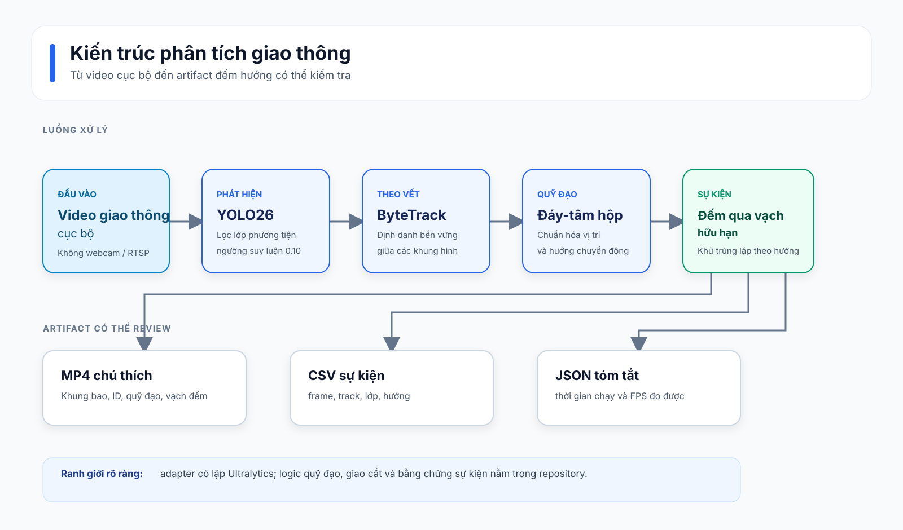

# Phân tích giao thông với YOLO26 + ByteTrack

[](https://github.com/hana200887/yolo26/actions/workflows/ci.yml)

Từ video giao thông cục bộ đến sự kiện đếm có thể kiểm tra: đây là pipeline
computer vision phục vụ học tập và portfolio. Pipeline biến một video thành
phát hiện YOLO26, định danh bền vững bằng ByteTrack, quỹ đạo, sự kiện qua vạch
theo hướng và artifact để review. Ranh giới model được giữ mỏng; logic phân
tích theo thời gian nằm trong repository này.

## Demo

Demo ngắn dưới đây là derivative dài 4.6 giây từ lượt chạy giao thông có
license của Phase 2. Nó hiển thị khung bao, track ID, nhãn hướng di chuyển,
quỹ đạo, vạch đếm, tổng theo hướng và FPS đo được.


Xem [nguồn gốc của demo](examples/README.md) để biết attribution, checksum,
khoảng frame chính xác và các giới hạn tái tạo. Video nguồn, MP4 đã chú thích
và model weights được chủ ý không commit.

## Kiến trúc

<p align="center">
  
</p>

Sơ đồ tĩnh phía trên hiển thị ổn định trên GitHub. Bạn có thể sửa bằng
[mã Mermaid](docs/diagrams/architecture.mmd). `ultralytics` được cô lập sau
một adapter nhỏ để tensor và result object của backend không rò rỉ vào domain
model.

## Cách hoạt động

1. **Phát hiện** lọc các detection YOLO26 theo lớp người tham gia giao thông
   đã cấu hình.
2. **Theo vết** dùng interface ByteTrack persistent của Ultralytics để gán
   detection qua nhiều frame; nhờ đó không đếm lại một detection mới ở mỗi
   frame.
3. **Phân tích** lưu vị trí đáy-tâm đã chuẩn hóa, phân loại hướng từ lịch sử
   ngắn và kiểm tra đoạn quỹ đạo giao cắt với vạch.
4. Một sự kiện chỉ được phát ra một lần cho mỗi `(track_id, direction)` sau
   các kiểm tra deadband và tuổi track tối thiểu. Sự kiện đếm được lưu ở CSV
   thay vì chỉ là một tổng overlay.

Cấu hình mặc định dùng ngưỡng suy luận 0.10 để ByteTrack còn candidate có độ
tin cậy thấp cho việc gán ID; overlay dùng ngưỡng hiển thị riêng là 0.40. Xem
[configs/default.yaml](configs/default.yaml).

## Cài đặt

Yêu cầu: Python 3.11 và [uv](https://docs.astral.sh/uv/).

```powershell
git clone https://github.com/hana200887/yolo26.git
cd yolo26
uv sync --all-groups --frozen
```

Để chạy `detect`, `track` hoặc `analyze`, hãy đặt file `yolo26n.pt` tương
thích ở thư mục gốc repository và tự lấy video nguồn theo license. Dự án không
đóng gói model weights hay media thô. Checksum của lượt chạy đã ghi nhận nằm
trong [bằng chứng Phase 2](docs/evidence/phase-2/phase-2-evidence.md).

## Cách dùng

Mọi lệnh xử lý nhận video local và mặc định ghi artifact dưới
`data/outputs/`. Dùng `--no-preview` khi chạy không tương tác.

```powershell
# Chỉ tạo detection theo từng frame.
uv run --frozen traffic-analytics detect `
  --source data/videos/street_traffic.webm `
  --config configs/default.yaml `
  --no-preview

# Tạo ByteTrack ID và quỹ đạo bền vững, chưa có sự kiện giao cắt.
uv run --frozen traffic-analytics track `
  --source data/videos/street_traffic.webm `
  --config configs/default.yaml `
  --no-preview

# Luồng đầy đủ: detection, tracking, quỹ đạo, đếm qua vạch theo hướng.
uv run --frozen traffic-analytics analyze `
  --source data/videos/street_traffic.webm `
  --config configs/default.yaml `
  --no-preview

# Chạy lại đánh giá sự kiện ở cửa sổ nhỏ đã commit; không cần video hay model.
uv run --frozen traffic-analytics evaluate `
  --predictions docs/evidence/phase-2/street_traffic-window-330-465.predictions.csv `
  --ground-truth data/annotations/street_traffic-window-330-465.v1.events.csv `
  --frame-tolerance 5
```

Các lệnh video tạo MP4 đã chú thích, CSV sự kiện có `frame_index`, `track_id`,
`class_name`, `direction`, cùng JSON tóm tắt thời gian chạy và FPS đo được.
Đường dẫn output có sẵn không bao giờ bị ghi đè im lặng.

## Kết quả

Các giá trị sau là quan sát từ một lượt chạy CPU đã ghi nhận đầy đủ, không
phải benchmark tổng quát:

| Đại lượng | Giá trị quan sát |
| --- | --- |
| Input | 1,050 frame từ một cảnh đường phố có license, 1,920 × 1,080 |
| Môi trường | Python 3.11.15, Ultralytics 8.4.118, OpenCV 4.14.0, chỉ CPU |
| Thời gian | 79.7015 s |
| Thông lượng | 13.17 FPS đã xử lý |
| Quan sát được theo vết | 10,918 |
| Sự kiện qua vạch dự đoán | 7 |

Một cửa sổ review liên tục 136 frame (4.53 giây) có một nhãn `bus, IN` được
gán bằng hỗ trợ AI. Kết quả là 1 TP, 4 FP, 0 FN: precision 0.20, recall 1.00
và F1 0.333. Lát cắt hẹp, tạm thời này được giữ lại để phơi bày biến thiên
tracker/detection; nó **không** phải benchmark có người gán nhãn độc lập hay
tuyên bố độ chính xác tổng quát.

## Luồng bằng chứng và đánh giá

<p align="center">
  
</p>

Sơ đồ này nối media nguồn, manifest provenance, lượt chạy local, nhãn có hỗ
trợ AI và chỉ số của cùng một cửa sổ review. Nó là cách đọc đúng kết quả:
traceable nhưng chưa đủ để suy rộng. Có thể chỉnh sửa bằng
[mã Mermaid](docs/diagrams/evaluation-provenance.mmd); chi tiết source,
lệnh chạy, artifact và giới hạn ở
[bằng chứng Phase 2](docs/evidence/phase-2/phase-2-evidence.md).

## Kiểm tra chất lượng

```powershell
uv run --frozen ruff format --check .
uv run --frozen ruff check .
uv run --frozen mypy src
uv run --frozen pytest -m "not model" --cov=traffic_analytics --cov-report=term-missing -q
uv run --frozen pip-audit
```

Smoke test với model thật là opt-in vì cần file weights local và có thể cần
network; test này bị loại khỏi CI.

## Giới hạn

- Lượt chạy hiện tại chỉ có một cảnh đường phố lịch sử; hình học vạch phụ
  thuộc camera.
- Lát cắt sự kiện có hỗ trợ AI và cần gán nhãn độc lập của con người trước khi
  báo cáo độ chính xác tổng hợp.
- 13.17 FPS là quan sát trên CPU, không phải tuyên bố real-time GPU.
- CLI chỉ nhận video local; webcam/RTSP, ước lượng tốc độ, LPR và web UI được
  chủ ý để ngoài phạm vi.

## Hướng phát triển

- Gán nhãn clip liên tục dài hơn với review độc lập và theo dõi mức đồng thuận.
- So sánh detector/tracker bằng các metric identity và counting rõ ràng.
- Chỉ thêm calibration theo camera khi đã có protocol đánh giá có nhãn.

## Giấy phép và nguồn gốc

Mã nguồn dự án dùng [AGPL-3.0-or-later](LICENSE). Visual demo là derivative
của media nguồn CC BY 3.0 và được attribution riêng ở
[examples/README.md](examples/README.md). Xem
[THIRD_PARTY_NOTICES.md](THIRD_PARTY_NOTICES.md) để biết notices về dependency
và media.
