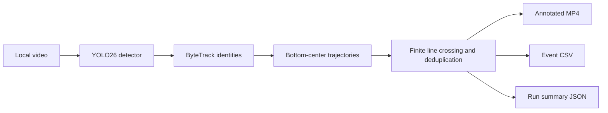

# Traffic Analytics with YOLO26 + ByteTrack

[](https://github.com/hana200887/yolo26/actions/workflows/ci.yml)

An educational, portfolio-focused computer-vision pipeline that turns a local traffic video into YOLO26 detections, persistent ByteTrack identities, trajectories, line-crossing events, and reviewable output artifacts. The model boundary stays thin; the temporal analytics logic is implemented in this repository.

## Demo

The short demo below is a 4.6-second derivative of the licensed traffic run used for Phase 2. It shows bounding boxes, track IDs, movement labels, trajectories, the configured counting line, directional totals, and measured FPS.


See [examples/README.md](examples/README.md) for attribution, checksum, exact frame range, and reproduction limits. The source video, annotated MP4, and model weights are intentionally not committed.

## Architecture



`ultralytics` is isolated behind a small adapter so backend tensors and result objects do not leak into the domain model.

## How it works

1. **Detect** filters YOLO26 detections to configured road-user classes.
2. **Track** uses Ultralytics' persistent ByteTrack interface to associate detections across frames; this avoids counting a new detection on every frame.
3. **Analyze** records normalized bottom-center positions, classifies motion over a short history, and tests track segments against the configured line.
4. A crossing is emitted only once per `(track_id, direction)` after deadband and minimum-age checks. Count events stay reviewable in a CSV rather than becoming only an overlay total.

The default configuration uses a 0.10 inference threshold so ByteTrack can use lower-confidence candidates for association, while overlays use the separately configured 0.40 display threshold. See [configs/default.yaml](configs/default.yaml).

## Installation

Requirements: Python 3.11 and [uv](https://docs.astral.sh/uv/).

```powershell
git clone https://github.com/hana200887/yolo26.git
cd yolo26
uv sync --all-groups --frozen
```

For `detect`, `track`, or `analyze`, place a compatible `yolo26n.pt` file in the repository root and obtain the licensed source video separately. The project does not bundle model weights or raw media. The exact checksum used for the recorded run is in the [Phase 2 evidence](docs/evidence/phase-2/phase-2-evidence.md).

## Usage

All processing commands accept a local video source and write artifacts under `data/outputs/` by default. Use `--no-preview` for a non-interactive run.

```powershell
# Per-frame detector output only.
uv run --frozen traffic-analytics detect `
  --source data/videos/street_traffic.webm `
  --config configs/default.yaml `
  --no-preview

# Persistent ByteTrack identities and trajectories, without crossing events.
uv run --frozen traffic-analytics track `
  --source data/videos/street_traffic.webm `
  --config configs/default.yaml `
  --no-preview

# Full detection, tracking, trajectory, directional line-crossing analysis.
uv run --frozen traffic-analytics analyze `
  --source data/videos/street_traffic.webm `
  --config configs/default.yaml `
  --no-preview

# Reproduce the committed small-window event evaluation; no video or model needed.
uv run --frozen traffic-analytics evaluate `
  --predictions docs/evidence/phase-2/street_traffic-window-330-465.predictions.csv `
  --ground-truth data/annotations/street_traffic-window-330-465.v1.events.csv `
  --frame-tolerance 5
```

The video commands produce an annotated MP4, an event CSV with `frame_index`, `track_id`, `class_name`, and `direction`, plus a summary JSON containing measured elapsed time and processing FPS. Existing output paths are never silently overwritten.

## Results

The following values are observations from one fully recorded CPU-only run, not a general benchmark:

| Measurement | Observed value |
| --- | --- |
| Input | 1,050 frames from one 1,920 x 1,080 licensed street scene |
| Environment | Python 3.11.15, Ultralytics 8.4.118, OpenCV 4.14.0, CPU only |
| Elapsed time | 79.7015 s |
| Throughput | 13.17 processed FPS |
| Tracked observations | 10,918 |
| Predicted crossing events | 7 |

One continuous 136-frame (4.53-second) review window contains one AI-assisted `bus, IN` ground-truth event. It produced 1 TP, 4 FP, 0 FN: precision 0.20, recall 1.00, and F1 0.333. This narrow, provisional slice is intentionally included to expose tracker/detection variation; it is **not** a human-verified benchmark or a claim of general accuracy.

Full source provenance, commands, artifacts, and limitations are in the [Phase 2 evidence](docs/evidence/phase-2/phase-2-evidence.md).

## Verification

```powershell
uv run --frozen ruff format --check .
uv run --frozen ruff check .
uv run --frozen mypy src
uv run --frozen pytest -m "not model" --cov=traffic_analytics --cov-report=term-missing -q
uv run --frozen pip-audit
```

The real-model smoke test is opt-in because it needs a local weight file and may require network access. It is excluded from CI.

## Limitations

- The current run covers one historical street scene; the line geometry is camera-specific.
- The event slice is AI-assisted and needs independent human annotation before aggregate accuracy is reported.
- 13.17 FPS is an observed CPU result, not a real-time GPU claim.
- The CLI accepts local video files only; webcam/RTSP ingestion, speed estimation, LPR, and a web UI are intentionally out of scope.

## Future work

- Label longer continuous clips with independent human review and agreement tracking.
- Compare detector/tracker settings using explicit counting and identity metrics.
- Add camera-specific calibration only after a labeled evaluation protocol is available.

## License and provenance

Project code is licensed under [AGPL-3.0-or-later](LICENSE). The demo visual is a derivative of CC BY 3.0 source media and is attributed separately in [examples/README.md](examples/README.md). See [THIRD_PARTY_NOTICES.md](THIRD_PARTY_NOTICES.md) for dependency and media notices.
