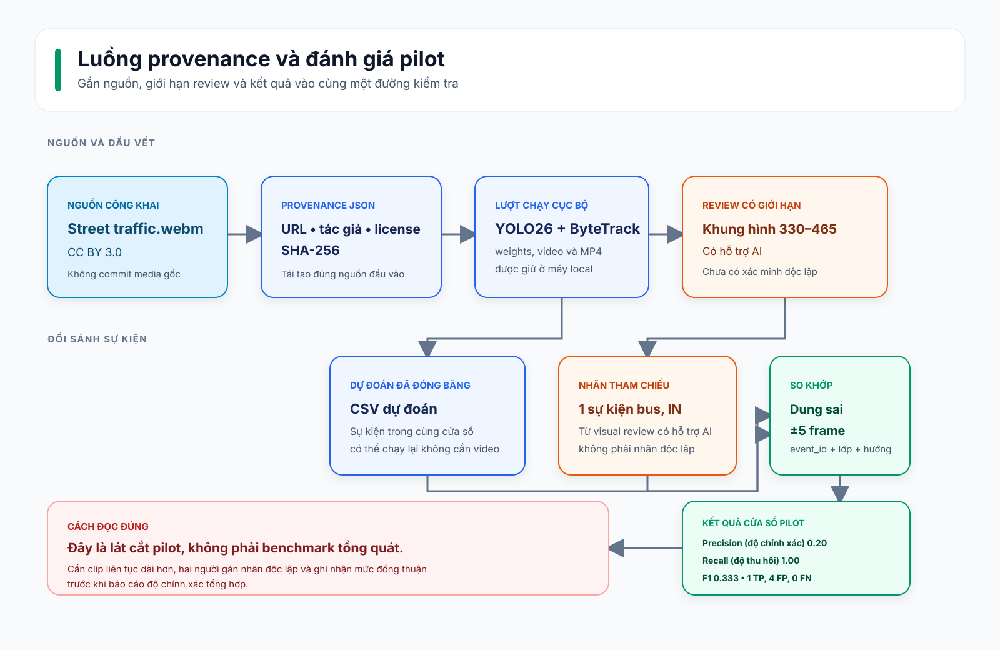

# Bằng chứng Phase 2: pilot giao thông thật có license

## Điều này chứng minh gì?

Phase này chứng minh repository có thể chạy YOLO26 + ByteTrack trên một clip
giao thông local có license, tạo artifact có thể review và đánh giá đếm sự
kiện với schema annotation độc lập với tracker. Nó **không** tuyên bố độ chính
xác tổng quát, hiệu năng GPU real-time hay benchmark đã được con người xác
minh độc lập.

## Luồng provenance và đánh giá



Sơ đồ gắn source, manifest, lượt chạy local, nhãn review và metric vào cùng
một đường kiểm tra. Bản chỉnh sửa được là
[Mermaid source](../../diagrams/evaluation-provenance.mmd). Kết quả cuối chỉ
là lát cắt pilot, không phải benchmark tổng quát.

## Nguồn và attribution

- Tiêu đề: **Street traffic.webm** — giao thông đường phố tại San Francisco.
- Tác giả: **Editor** (`https://www.youtube.com/user/Editor`).
- Trang nguồn: `https://commons.wikimedia.org/wiki/File:Street_traffic.webm`.
- License: [CC BY 3.0](https://creativecommons.org/licenses/by/3.0/).
- Thay đổi thực hiện: dự án chạy object detection/tracking và tạo derivative
  đã chú thích để review local; video gốc không được commit.

File nguồn chính xác và metadata license được ghi trong
[`street_traffic.provenance.json`](street_traffic.provenance.json). SHA-256 là
`e5facb24baf755f0c1193999d823e99f6032661ad2bdef5cc28cc1cbbfde03e2`.

## Lượt chạy có thể tái tạo

Chạy từ thư mục gốc repository sau khi lấy file nguồn có checksum khớp manifest
provenance:

```powershell
uv run --frozen traffic-analytics analyze `
  --source data/videos/street_traffic.webm `
  --config configs/default.yaml `
  --no-preview `
  --max-frames 1050
```

Quan sát lúc chạy ngày 2026-08-12:

| Hạng mục | Giá trị quan sát |
| --- | --- |
| Input | VP8/WebM, 1,920 × 1,080, 1,050 decoded frame, 35.004 s |
| Model | `yolo26n.pt`, SHA-256 `9b09cc8bf347f0fc8a5f7657480587f25db09b34bf33b0652110fb03a8ad4fef` |
| Cấu hình | `configs/default.yaml`, SHA-256 `211e99be881db92d7a0e8dbe5763514412172ac6ffdbd3d64a95216e02f9b3cb` |
| Runtime | Python 3.11.15, Ultralytics 8.4.118, OpenCV 4.14.0, Torch 2.13.0+cpu |
| Accelerator | Chỉ CPU (`torch.cuda.is_available() == false`) |
| Tổng thời gian chạy | 79.7015 s |
| Thông lượng xử lý | 13.17 FPS |
| Quan sát được theo vết | 10,918 |
| Sự kiện qua vạch dự đoán | 7 |

Video output ban đầu nhận timestamp 1,000 FPS không hợp lệ từ OpenCV cho
WebM. `street_traffic-analyze.review-30fps.mp4` là H.264 re-encode local của
cùng chuỗi frame đã chú thích tại 30 FPS và 35.000 s, chỉ tạo để review trực
quan. Code hiện từ chối source FPS không hợp lý (>240) và fallback về 30 FPS.
Việc sửa này có regression test.

Artifact local của lượt chạy này (đều bị Git ignore):

```text
data/outputs/street_traffic-analyze.events.csv
data/outputs/street_traffic-analyze.summary.json
data/outputs/street_traffic-analyze.mp4
data/outputs/street_traffic-analyze.review-30fps.mp4
```

## Lát cắt đánh giá sự kiện tạm thời

Nhãn tại
[`data/annotations/street_traffic-window-330-465.v1.events.csv`](../../../data/annotations/street_traffic-window-330-465.v1.events.csv)
bao phủ một cửa sổ liên tục 136 frame (frame 330–465; 4.53 s tại 30 FPS). Người
review xác nhận bằng trực quan một giao cắt `bus, IN` ở frame 357. Nhãn được
tạo bằng **visual review có hỗ trợ AI và chưa được con người xác minh độc lập**.

Prediction cùng cửa sổ đã được đóng băng ở
[`street_traffic-window-330-465.predictions.csv`](street_traffic-window-330-465.predictions.csv),
vì vậy có thể chạy lại đánh giá nhỏ này mà không commit video:

```powershell
uv run --frozen traffic-analytics evaluate `
  --predictions docs/evidence/phase-2/street_traffic-window-330-465.predictions.csv `
  --ground-truth data/annotations/street_traffic-window-330-465.v1.events.csv `
  --frame-tolerance 5
```

Kết quả mong đợi:

```json
{
  "total_predictions": 5,
  "total_ground_truth": 1,
  "true_positives": 1,
  "false_positives": 4,
  "false_negatives": 0,
  "precision": 0.2,
  "recall": 1.0,
  "f1": 0.33333333333333337,
  "absolute_count_error": 4,
  "frame_tolerance": 5
}
```

Kết quả này cố ý phơi bày một điểm yếu: biến thiên tạm thời của tracker/detection
trong traffic đông, bị che khuất một phần tạo bốn sự kiện không khớp ở cửa sổ
review. Đây là baseline artifact hữu ích, không phải performance claim.

## Giới hạn review và bước dữ liệu tiếp theo

- Đây là một cảnh đường phố lịch sử, không phải dataset đại diện.
- Vạch cố định phụ thuộc scene; cần calibration lại cho camera khác.
- Pilot annotation hẹp và có hỗ trợ AI. Trước khi báo cáo độ chính xác tổng
  hợp, cần gán nhãn clip liên tục, dùng hai annotator độc lập, giải quyết bất
  đồng và ghi nhận mức đồng thuận.
- Media nguồn, model weights và video output giữ local để GitHub repository
  gọn nhẹ. Người tái tạo phải lấy source qua trang license và kiểm tra checksum.
